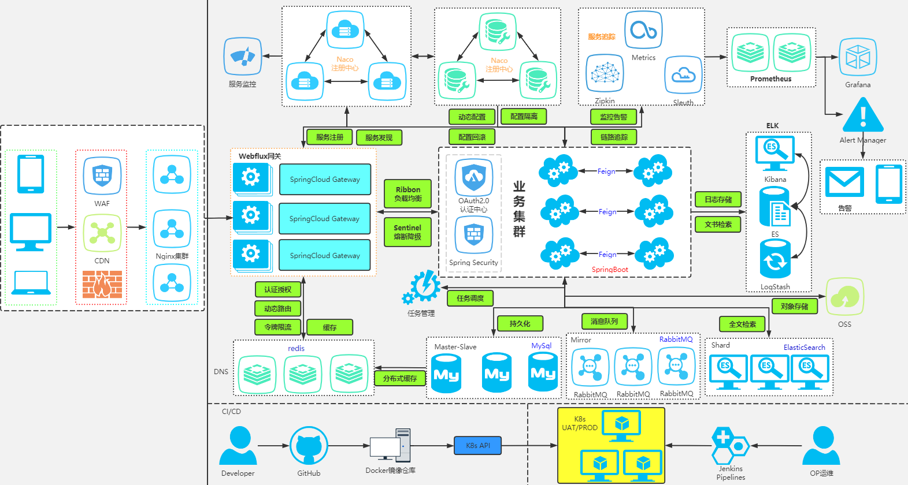
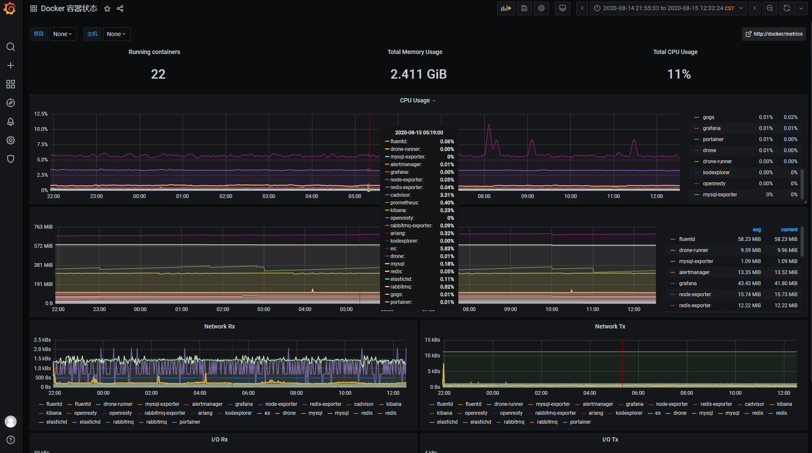
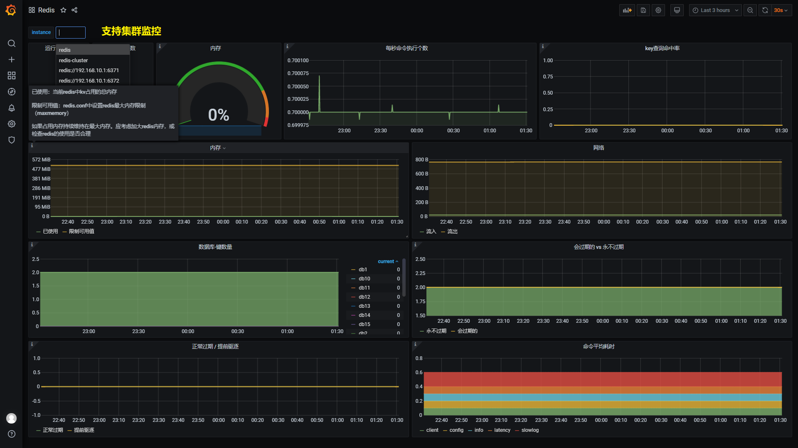
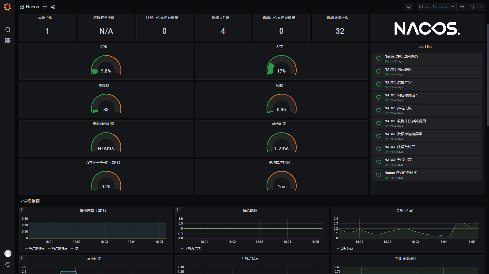
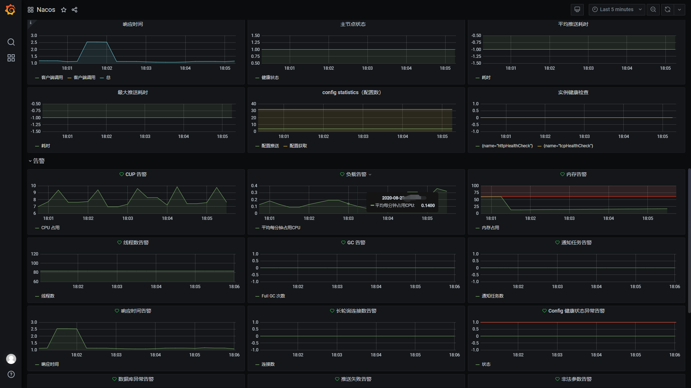
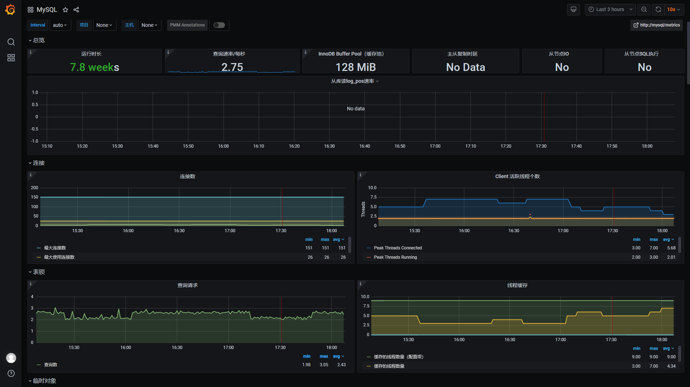
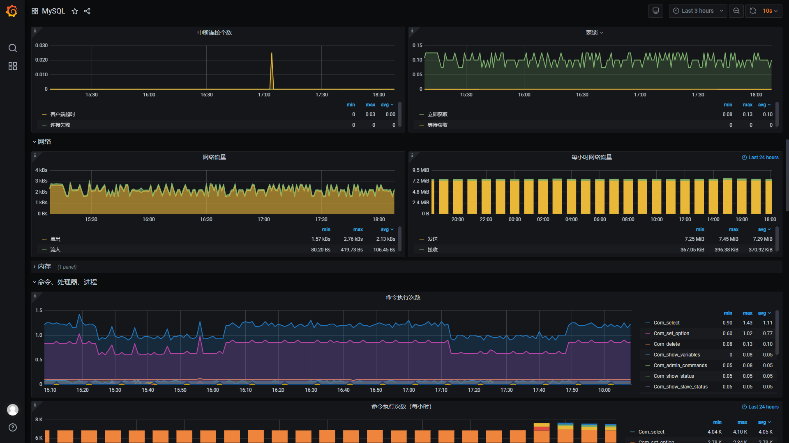
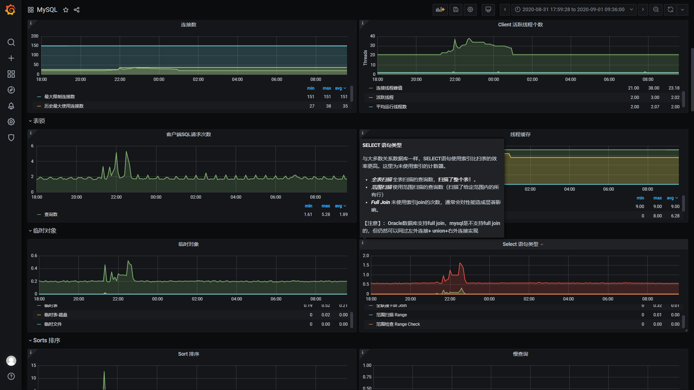
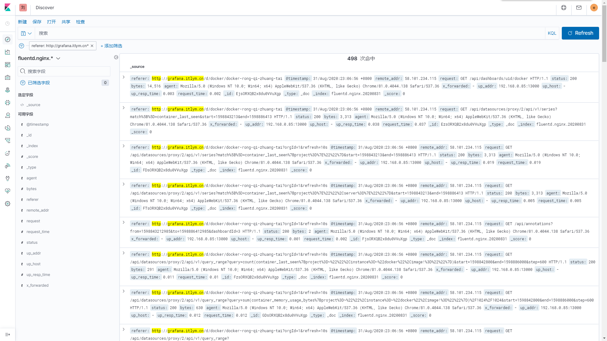

# shoulder-platform

## 简介：

`shoulder-platform` 是一个 `SaaS` 平台（仅实现基础能力，不包含具体业务），代码简洁，架构清晰，非常适合学习使用。

## 架构图

在线工具：[https://app.diagrams.net/](https://app.diagrams.net/) [https://processon.com/](https://processon.com/)

## 在线预览

- [开发规范地址](http://spec.itlym.cn)
- [Grafana + Prometheus 监控系统](http://grafana.itlym.cn)（访客账号密码：`shoulder` / `shoulder123`，仅包含仪表盘查看权限）
- [EFK 日志系统](http://kibana.itlym.cn)（访客账号密码：`shoulder` / `shoulder123`，仅包含日志检索查看权限）
- 平台地址( 开发中 )
- ~~[zipkin 链路追踪系统](http://zipkin.itlym.cn)（暂时下线）~~

# 能力介绍

- 能力概览
	- 单点登录
    - 用户管理
	- 资源权限管理
    - 通知推送中心（短信、邮件）
    - 错误码中心（查询错误码，大概产生原因，解决措施）
    - 知识库(记录常见问题排查方式等）
    - 在线 api 文档中心
    
- 核心框架
    - `SpringBoot` 
    - `SpringCloud`
    - `Shoulder Framework`
    - 服务认证: Spring Security（Oauth、JWT）

- 微服务治理方案选型
    - 服务注册、服务发现: nacos
    - 服务调用: feign + 负载均衡: Ribbon / Dubbo
    - 限流 & 断路器: Sentinel
    - 配置中心:nacos
    - 消息通知
        - rabbitMQ、KafKa
    - 文件存储
        - ceph、OSS..
    - 分布式任务调度
        - Power Job
    - 分布式事务
        - Seata
    - 数据同步
        - canal
    - 监控
        - 集群监控：spring-boot-actuator + spring-boot-admin
        - 服务监控：sentinel
        - 链路追踪：zipkin/Skywalking（根据部署机器性能选择）
        - 指标监控：metrics + exporter + prometheus + grafana
        - 主机监控、容器监控：cAdvisor
        - 告警：alertManager
        - 日志监控 EFK（Elastic Search + Fluentd + Kibana）
    - 持续集成、持续部署（不限制）
        - 版本控制：Git
        - 接口文档：openApi3
        - 代码审查：Sonar
        - 自动测试：AutoTest
        - 持续集成：Maven、Jenkins、Drone
        - 部署：Docker、K8s
        - 发布方式：金丝雀发布、蓝绿发布、灰度发布（Ribbon）
    - 数据智能
        - ETL：
        - 数据处理：Flink、Google Data Flow、Beam
   

- 认证中心
    - 单点登录
    - 会话管理
    - 授权管理
    
- 用户中心
    - 用户、组织、人事管理
    - 租户管理
    
- 权限中心
    - 菜单权限
    - 角色权限
    - 岗位管理
    - 资源管理
    - 应用管理
    
- 消息推送
    - 短信
    - 邮件
    - 钉钉
    - 企业微信
    - App（第三方）

- 存储中心
    - 本地文件
        - 结合数据库、本地文件路径
    - 自建存储系统
        - **minio**、FastDFS、Hadoop、GDFS等
    - 第三方OOS存储
        - **七牛云、阿里云、亚马逊云**、腾讯云、华为云
    
- 平台
    - 用户平台
    - 监控门户
    - 运维平台
    - 运营平台（后台管理）
    
- 网关
    - Web 浏览器
    - H5 小程序
    - App
    - OpenApi
    - 静态资源
    
## 启动与使用

- IDEA
- jar
- docker
    
## 如果觉得对您有帮助，请点右上角 "Star" 支持一下吧，谢谢！

## 文档

## 展示

#### 监控

[监控系统预览地址](http://grafana.itlym.cn)（访客账号密码：`shoulder` / `shoulder123`，演示账号仅包含仪表盘查看权限，不能编辑）

#### 日志收集

ELK展示nginx日志演示

查看所有访问 grafana.itlym.cn 的访问日志

查看所有请求时间大于 200ms 的访问日志

## 项目代码地址

| 项目 | 开源地址 | 说明 |
|---|---|---|
| Shoulder Framework | [github](https://github.com/ChinaLym/Shoulder-Framework)、[gitee](https://gitee.com/ChinaLym/shoulder-framework) | 开发框架，在 Spring Boot 基础之上，结合[软件优雅设计与开发最佳实践](http://spec.itlym.cn)，增加常用的功能，任何基于`Spring Boot`/`Spring Cloud`的项目都可以使用。 |
| shoulder-framework-demo | [github](https://github.com/ChinaLym/shoulder-framework-demo)、[gitee](https://gitee.com/ChinaLym/shoulder-framework) | 以简单的例子介绍 `Shoulder Framework` 的使用 |
| shoulder-plugins | [github](https://github.com/ChinaLym/shoulder-plugins)、[gitee](https://gitee.com/ChinaLym/shoulder-plugins) | shoulder 提供的的减少开发工作量的`maven`插件（非必须，如遵循[软件优雅设计与开发最佳实践-国际化开发](http://doc.itlym.cn/specs/base/i18n.html)时推荐希望使用自动生成多语言翻译资源文件的插件减少开发工作量） |
| shoulder-lombok | [github](https://github.com/ChinaLym/shoulder-lombok)、[gitee](https://gitee.com/ChinaLym/shoulder-lombok) | 在`lombok`之上，增加 `@SLog` 注解，用于简化[软件优雅设计与开发最佳实践-错误码与日志](http://spec.itlym.cn/specs/base/errorCode.html) -shoulder 实现的日志框架的使用（非必须） |
| shoulder-lombok-idea-plugin | [github](https://github.com/ChinaLym/lombok-intellij-plugin)、[gitee](https://gitee.com/ChinaLym/lombok-intellij-plugin) | 在 `lombok-idea-plugin`之上，在 IDEA 中增加`@SLog`的编码提示，以更好的使用 `shoulder-lombok`（非必须，使用 shoulder-lombok 时推荐） |
| **Shoulder Platform** | [github](https://github.com/ChinaLym/Shoulder-Platform)、[gitee](https://gitee.com/ChinaLym/shoulder-Platform) | SaaS 开发平台，提供了基础通用能力，与具体业务无关 |
| Shoulder iPaaS | [github](https://github.com/ChinaLym/shoulder-iPaaS)、[gitee](https://gitee.com/ChinaLym/shoulder-iPaaS) | iPaaS 平台，介绍了常见中间件、监控系统、私有基础平台如何部署 |

## 层次设计

| 层次 | 定位 | 方案 | Shoulder 支持 |
|---|---|---|---|
| 业务应用服务 `SaaS` | 面向用户设计，更应该考虑如何方便用户 | 使用者根据实际业务把握 | `shoulder-framework` 提供了一些常用的能力，以及规约的对接；`shoulder-platform-common` 提供了快速开发一个与 `shoulder-platform` 设计、技术、风格统一的应用服务 |
| 平台对接开发包 `SDK` | 降低使用者调用 `shoulder` 的开发成本和难度 | 以 Spring Boot 自动装配形式提供，包含使用文档和Demo | 提供对接 shoulder-platform的默认实现，使用者也可根据平台api接口文档自行实现 |
| 共性业务层 `aPaaS` | 通用基础功能如认证、注册、授权、通知推送、知识库、错误码查询等 | api网关、web管理平台、用户中心、通知中心 |  |
| 开发脚手架 `工具` | 统一维护共性代码，提供常用能力如异常拦截、错误码、安全加密等，统一管理技术和依赖版本 | `spring boot`、`spring cloud`、`shoulder-framework`、`shoulder-platform-common` 等 | 提供一些常用的功能封装，**可直接用于任何项目** |
| 软件开发设计理论指导 `理论` | 软件开发设计理论指导，主要为了系统的易维护、易扩展、易观测、安全性 | 总结业界开发设计实践经验如 `阿里巴巴Java开发规范` 结合而成，详见[优雅软件设计规范](http://spec.itlym.cn) | shoulder给予了一定的理论指导，但这是**可选的**，不强制使用者必须遵循 |
| 软件平台基础层 `iPaaS` | 无业务含义的基础中间件，数据库、消息队列、监控中间件、告警中间件等 | MySql、RabbitMQ、Nacos、Zipkin、ElasticSearch、Docker、K8s 等，以 `Docker` 镜像方式提供 | 提供大部分场景的最佳技术方案选型，安装、部署、参数调优方案，**可直接用于任何项目** |
| 硬件基础层 `IaaS` | 硬件支撑，如CPU、内存、网络、存储等 | 依赖云主机厂商，如阿里云、腾讯云、亚马逊云等 | 无，shoulder不干涉该层 |
