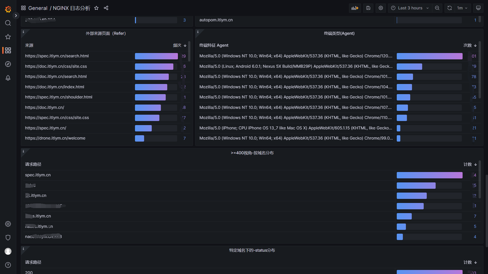

<h1 align="center"><a href="https://github.com/ChinaLym/shoulder-platform" target="_blank">Shoulder Platform</a></h1>

# 📖介绍

`shoulder-platform` 是一个符合[OpenSergo 服务治理标准](https://opensergo.io/)的 `SaaS` 平台（仅实现基础能力，不包含具体业务），代码简洁，架构清晰，非常适合学习使用。要说 `shoulder-platform` 和 `shoulder` 的关系，可以简单理解为 `spring cloud` 和 `spring boot` 的关系。

# 🛠️ 架构图

# 👀 在线预览

- [Grafana + Prometheus 监控系统](https://grafana.itlym.cn)（账号：`shoulder` 密码： `shoulder123`）
- ~~[EFK 日志系统](https://kibana.itlym.cn)（账号：`shoulder` 密码： `shoulder123`）（暂时下线）~~
- ~~[注册中心 / 配置中心地址](https://nacos.itlym.cn)（暂时下线）~~
- ~~[限流配置中心地址](https://sentinel.itlym.cn)（暂时下线）~~
- ~~[zipkin 链路追踪系统](https://zipkin.itlym.cn)（暂时下线）~~

- [开发规范地址](https://doc.itlym.cn)
- [私有代码版本控制地址](https://git.itlym.cn)
- [持续集成服务器地址](https://drone.itlym.cn)

# 🧩组件列表 

- 认证中心
- 用户中心
- 权限中心
- 消息推送
- 存储中心
- 用户平台
- 监控门户 
- 运维平台
- 运营平台（后台管理）
- 网关
    
## 🚀 启动与使用

- IDEA 直接运行：
- jar 方式运行：
- docker 方式运行：

# 📄 文档
...

# 🔥 展示

## 📈 监控

[监控系统预览地址](https://grafana.itlym.cn)（访客账号密码：`shoulder` / `shoulder123`，演示账号仅包含仪表盘查看权限，不能编辑）

## 🔍︎ 日志采集与搜索

ELK展示nginx日志演示

查看所有访问 grafana.itlym.cn 的访问日志

查看所有请求时间大于 200ms 的访问日志

# ✈ 规划 & 发展路线

`Shoulder` 希望做一个整套的可复用的平台（`PaaS`），使用者只需要做做自己的业务即可。整体格局如下

- `Shoulder iPaaS` 基础中间件环境 Shoulder 提供依赖中间件的`Docker`镜像或部署教程（如 数据库、消息队列、服务注册中心、任务调度中心、搜索引擎、报警与监控系统等）。
- `Shoulder Specific` 软件系开发设计注意事项、[落地方案和规范](https://doc.itlym.cn)
- **Shoulder Framework**  即本开源项目，提供共性能力封装，减少代码冗余，降低系统开发维护成本。
- `Shoulder Platform` 共性业务平台，提供 `用户平台`、`支付平台`、`通知中心`、`业务网关`、`数据字典`、`全局ID生产器` 等基础、通用业务能力平台
- `Shoulder Platform SDK` 以 sdk 形式方便业务层对接使用。

## 相关项目代码地址

| 项目 | 开源地址 | 说明 |
|---|---|---|
| Shoulder Framework | [github](https://github.com/ChinaLym/shoulder-framework)、[gitee](https://gitee.com/ChinaLym/shoulder-framework) | 开发框架，在 Spring Boot 基础之上，结合[软件优雅设计与开发最佳实践](https://doc.itlym.cn)，增加常用的功能，任何基于`Spring Boot`/`Spring Cloud`的项目都可以使用。 |
| shoulder-framework-demo | [github](https://github.com/ChinaLym/shoulder-framework-demo)、[gitee](https://gitee.com/ChinaLym/shoulder-framework) | 以简单的例子介绍 `Shoulder Framework` 的使用 |
| shoulder-plugins | [github](https://github.com/ChinaLym/shoulder-plugins)、[gitee](https://gitee.com/ChinaLym/shoulder-plugins) | shoulder 提供的的减少开发工作量的`maven`插件（非必须，如遵循[软件优雅设计与开发最佳实践-国际化开发](https://doc.itlym.cn/specs/base/i18n.html)时推荐希望使用自动生成多语言翻译资源文件的插件减少开发工作量） |
| shoulder-lombok | [github](https://github.com/ChinaLym/shoulder-lombok)、[gitee](https://gitee.com/ChinaLym/shoulder-lombok) | 在`lombok`之上，增加 `@SLog` 注解，用于简化[软件优雅设计与开发最佳实践-错误码与日志](https://doc.itlym.cn/specs/base/errorCode.html) -shoulder 实现的日志框架的使用（非必须） |
| shoulder-lombok-idea-plugin | [github](https://github.com/ChinaLym/lombok-intellij-plugin)、[gitee](https://gitee.com/ChinaLym/lombok-intellij-plugin) | 在 `lombok-idea-plugin`之上，在 IDEA 中增加`@SLog`的编码提示，以更好的使用 `shoulder-lombok`（非必须，使用 shoulder-lombok 时推荐） |
| **Shoulder Platform** | [github](https://github.com/ChinaLym/shoulder-platform)、[gitee](https://gitee.com/ChinaLym/shoulder-Platform) | SaaS 开发平台，提供了基础通用能力，与具体业务无关 |
| Shoulder iPaaS | [github](https://github.com/ChinaLym/shoulder-iPaaS)、[gitee](https://gitee.com/ChinaLym/shoulder-iPaaS) | iPaaS 平台，介绍了常见中间件、监控系统、私有基础平台如何部署 |

## 层次设计

| 层次 | 定位 | 方案 | Shoulder 支持 |
|---|---|---|---|
| 业务应用服务 `SaaS` | 面向用户设计，更应该考虑如何方便用户 | 使用者根据实际业务把握 | `shoulder-framework` 提供了一些常用的能力，以及规约的对接；`shoulder-platform-common` 提供了快速开发一个与 `shoulder-platform` 设计、技术、风格统一的应用服务 |
| 平台对接开发包 `SDK` | 降低使用者调用 `shoulder` 的开发成本和难度 | 以 Spring Boot 自动装配形式提供，包含使用文档和Demo | 提供对接 shoulder-platform的默认实现，使用者也可根据平台api接口文档自行实现 |
| 共性业务层 `aPaaS` | 通用基础功能如认证、注册、授权、通知推送、知识库、错误码查询等 | api网关、web管理平台、用户中心、通知中心 |  |
| 开发脚手架 `工具` | 统一维护共性代码，提供常用能力如异常拦截、错误码、安全加密等，统一管理技术和依赖版本 | `spring boot`、`spring cloud`、`shoulder-framework`、`shoulder-platform-common` 等 | 提供一些常用的功能封装，**可直接用于任何项目** |
| 软件开发设计理论指导 `理论` | 软件开发设计理论指导，主要为了系统的易维护、易扩展、易观测、安全性 | 总结业界开发设计实践经验如 `阿里巴巴Java开发规范` 结合而成，详见[优雅软件设计规范](https://doc.itlym.cn) | shoulder给予了一定的理论指导，但这是**可选的**，不强制使用者必须遵循 |
| 软件平台基础层 `iPaaS` | 无业务含义的基础中间件，数据库、消息队列、监控中间件、告警中间件等 | MySql、RabbitMQ、Nacos、Zipkin、ElasticSearch、Docker、K8s 等，以 `Docker` 镜像方式提供 | 提供大部分场景的最佳技术方案选型，安装、部署、参数调优方案，**可直接用于任何项目** |
| 硬件基础层 `IaaS` | 硬件支撑，如CPU、内存、网络、存储等 | 依赖云主机厂商，如阿里云、腾讯云、亚马逊云等 | 无，shoulder不干涉该层 |

# 📒 版本变更记录

当前暂未发布至maven仓库。

# 💗 贡献代码

欢迎各类型代码提交，不限于`优化代码格式`、`优化注释/JavaDoc`、`修复 BUG`、`新增功能`
，更多请参考 [如何贡献代码](CONTRIBUTING.MD)

# 📩 反馈 or 联系我

感谢小伙伴们的 **[🌟Star](https://gitee.com/ChinaLym/shoulder-framework/star)** 、 **🍴Fork** 、 **🏁PR**，欢迎使用 `issue` 或 [cn_lym@foxmail.com](mailto:cn_lym@foxmail.com) 交流，如 留下你的建议、期待的新功能等~

`Shoulder` 不求使用最广，而是致力于成为使用体验最好的开发框架，您任何的使用需求、建议、想法都可以留下来与我们沟通，`Shoulder`
将与您一起思考攻克疑难，助天下的开发者更好更安心得使用技术助力业务腾飞！

### 👨‍💼 关于作者

多次参与 Alibaba 核心系统重构与设计，主导过多次 D11 级别大促保障，欢迎技术交流与简历投递～
- 该项目为作者在业余时间独立开发和维护的个人项目，非阿里巴巴官方产品。
