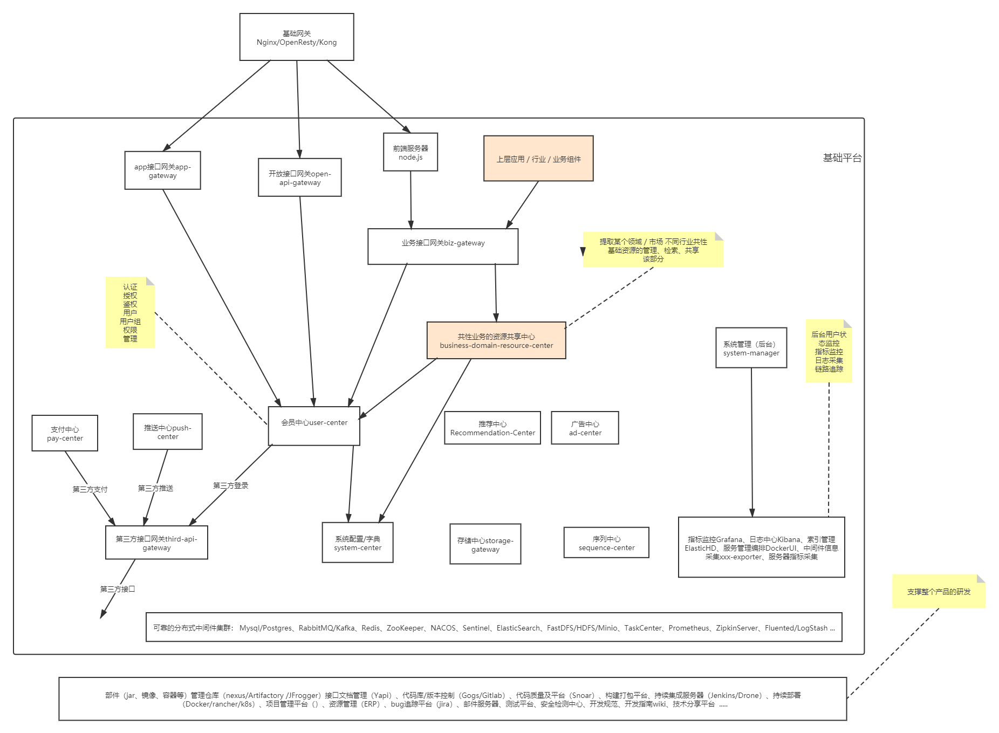

# 能力介绍

- 能力概览
    - 单点登录
    - 用户管理
    - 资源权限管理
    - 通知推送中心（短信、邮件）
    - 错误码中心（查询错误码，大概产生原因，解决措施、热门错误码统计）
    - 知识库(记录常见问题排查方式等）
    - 在线 api 文档中心

- 核心框架
    - `SpringBoot`
    - `SpringCloud`
    - `Shoulder Framework`
    - 服务认证: Spring Security（Oauth、JWT）

- 微服务治理方案选型
    - 服务注册、服务发现: nacos
    - 服务调用: feign + 负载均衡: Ribbon / Dubbo
    - 限流 & 断路器: Sentinel
    - 配置中心:nacos
    - 消息通知
        - rabbitMQ、KafKa
    - 文件存储
        - ceph、OSS..
    - 分布式任务调度
        - Power Job
    - 分布式事务
        - Seata
    - 数据同步
        - canal
    - 监控
        - 集群监控：spring-boot-actuator + spring-boot-admin
        - 服务监控：sentinel
        - 链路追踪：zipkin/Skywalking（根据部署机器性能选择）
        - 指标监控：metrics + exporter + prometheus + grafana
        - 主机监控、容器监控：cAdvisor
        - 告警：alertManager
        - 日志监控 EFK（Elastic Search + Fluentd + Kibana）
    - 持续集成、持续部署（不限制）
        - 版本控制：Git
        - 接口文档：openApi3
        - 代码审查：Sonar
        - 自动测试：AutoTest
        - 持续集成：Maven、Jenkins、Drone
        - 部署：Docker、K8s
        - 发布方式：金丝雀发布、蓝绿发布、灰度发布（Ribbon）
    - 数据智能
        - ETL：
        - 数据处理：Flink、Google Data Flow、Beam

- 认证中心
    - 单点登录
    - 会话管理
    - 授权管理

- 用户中心
    - 用户、组织、人事管理
    - 租户管理

- 权限中心
    - 菜单权限
    - 角色权限
    - 岗位管理
    - 资源管理
    - 应用管理

- 消息推送
    - 短信
    - 邮件
    - 钉钉
    - 企业微信
    - App（第三方）

- 存储中心
    - 本地文件
        - 结合数据库、本地文件路径
    - 自建存储系统
        - **minio**、FastDFS、Hadoop、GDFS等
    - 第三方OOS存储
        - **七牛云、阿里云、亚马逊云**、腾讯云、华为云

- 平台
    - 用户平台
    - 监控门户
    - 运维平台
    - 运营平台（后台管理）

- 网关
    - Web 浏览器
    - H5 小程序
    - App
    - OpenApi
    - 静态资源