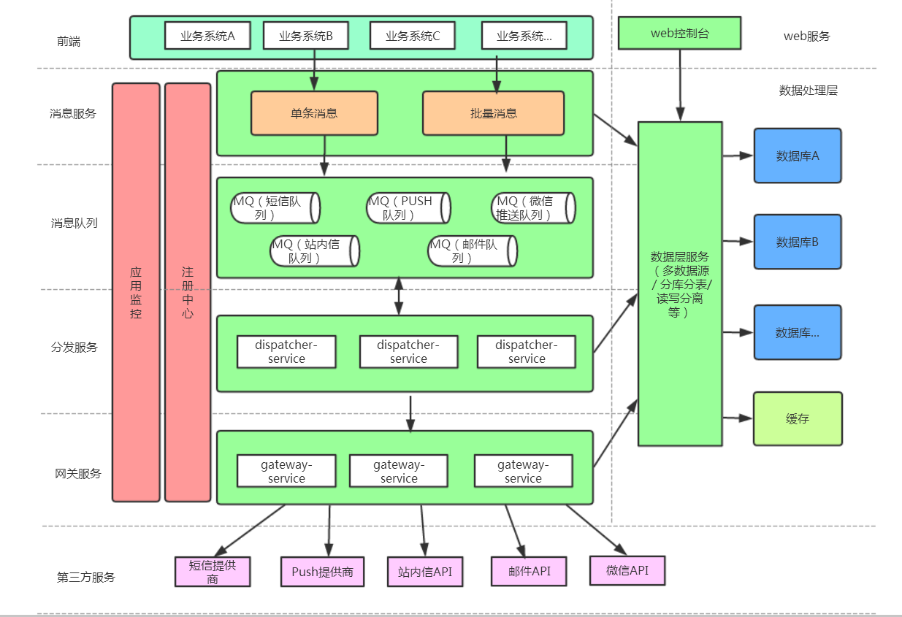

# shoulder-通知推送中心

包含
- 邮件推送
- 短信推送
- 站内消息推送
- xx 推送...

## 系统架构

如图 

改进：
- 若 `业务服务` 与 `消息中心` 采用 API 方式通信，可以提供`SDK`，简化调用，另推荐在此之上应添加业务网关，对上层业务屏蔽底层实现。
- 若 `业务服务` 与 `消息中心` 采用 MQ 方式通信，一般来说，无需再使用网关隔离。

TODO：考虑将各种推送方式集成，提供单体服务？
- 降低初学者的理解难度
- 减少小型场景的资源占用

----

站内消息：https://www.jianshu.com/p/c180e1510639