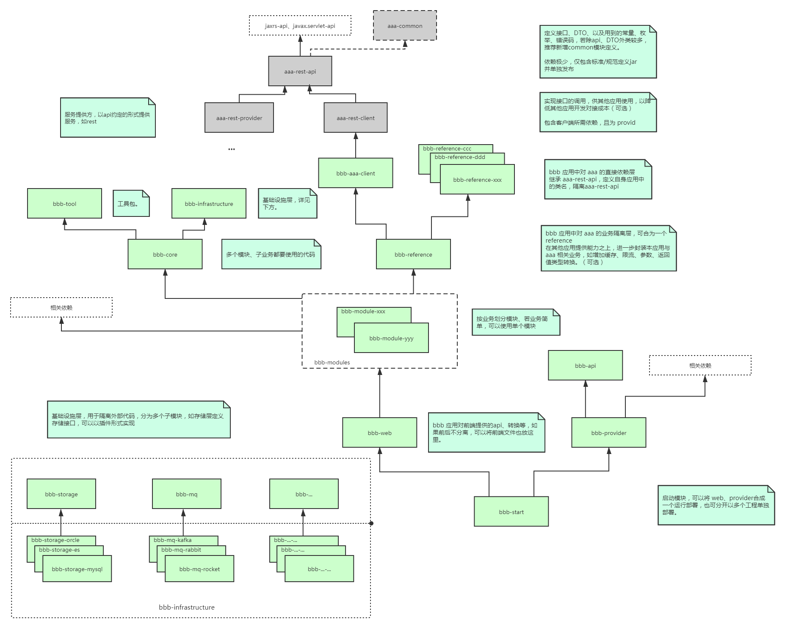

# shoulder-platform-common

Shoulder 平台各个工程的`基础设施层`统一实现

一般的工程模块图如下

* 本模块提供了基础中间件的选型与集成，目的：统一技术栈选型。
* 本项目中一般不应引入本模块以外的能力，以保证平台的安全与易维护。

（仓库较多，未创新新仓库维护）

由于各个工程必然存在重复的工作（技术选型与对接、依赖管理与维护、系统级规范与约定）在这里统一实现